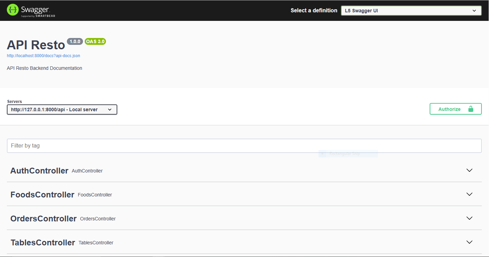
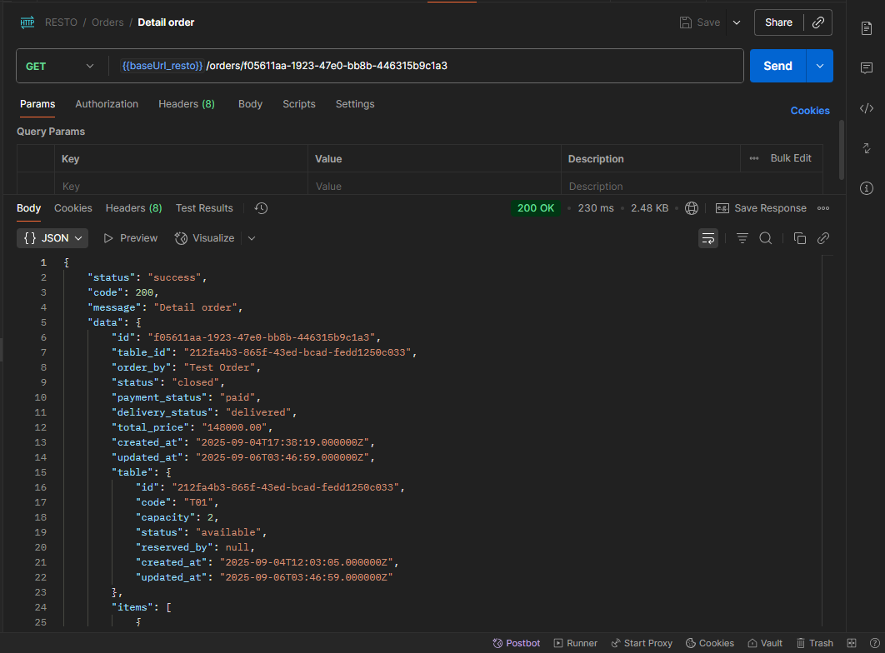

# Resto API Backend

Backend aplikasi restoran untuk manajemen meja, makanan, order, dan struk PDF.  
Dibangun menggunakan **Laravel 12**, **Sanctum** untuk autentikasi API, dan **Swagger** untuk dokumentasi.

---

## Fitur Utama

-   Autentikasi user (pelayan & kasir)
-   CRUD makanan (Foods)
-   CRUD meja (Tables)
-   Open / Close order
-   Tambah / Update / Hapus item di order
-   Generate PDF receipt untuk order
-   Dokumentasi API lengkap via Swagger UI

---

## Requirements

-   PHP 8.1+
-   Composer
-   MySQL 8+
-   Git

---

## Install & Setup

**1. Clone repository**

```bash
git clone https://github.com/ibnu-sodik/resto-backend.git
cd resto-backend
```

**2. Install dependencies**

```bash
composer install
```

**3. Setup Environment**

```
cp .env.example .env
```

**4. Generate app key & migrate database**

```
php artisan key:generate
php artisan migrate
php artisan db:seed
```

**5. Jalankan server**

```
php artisan serve
```

## Autentikasi

-   Menggunakan Laravel Sanctum (Bearer Token)
-   Login endpoint: POST /api/login
-   Response token dipakai di header:`Authorization: Bearer {token}`

## Dokumentasi API (Swagger)

-   Swagger UI tersedia di: [http://localhost:8000/api/documentation](http://localhost:8000/api/documentation)

## Notes

-   Semua tabel menggunakan **UUID** sebagai **primary key**.
-   Role: **pelayan, kasir**
-   Pastikan user login dengan role yang sesuai saat mencoba endpoint tertentu.

## Screenshots



